# 🔄 SYSTEM FLOW DOCUMENTATION - School Management System

## 📋 **System Overview**

Professional School Management System with comprehensive role-based access control, Instagram integration, and complete administrative modules designed for educational institutions.

---

## 🏗️ **System Architecture Flow**

### **High-Level Architecture**
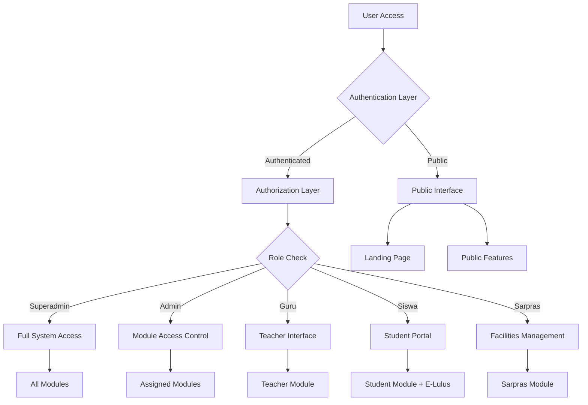
```mermaid
graph TB
    A[User Access] --> B{Authentication Layer}
    B -->|Authenticated| C[Authorization Layer]
    B -->|Public| D[Public Interface]
    
    C --> E{Role Check}
    E -->|Superadmin| F[Full System Access]
    E -->|Admin| G[Module Access Control]
    E -->|Guru| H[Teacher Interface]
    E -->|Siswa| I[Student Portal]
    E -->|Sarpras| J[Facilities Management]
    
    D --> K[Landing Page]
    D --> L[Public Features]
    
    F --> M[All Modules]
    G --> N[Assigned Modules]
    H --> O[Teacher Module]
    I --> P[Student Module + E-Lulus]
    J --> Q[Sarpras Module]
```

### **Database Architecture**
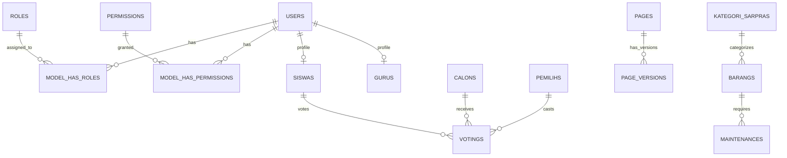
```mermaid
erDiagram
    USERS ||--o{ MODEL_HAS_ROLES : has
    ROLES ||--o{ MODEL_HAS_ROLES : assigned_to
    PERMISSIONS ||--o{ MODEL_HAS_PERMISSIONS : granted
    USERS ||--o{ MODEL_HAS_PERMISSIONS : has
    
    USERS ||--o| SISWAS : profile
    USERS ||--o| GURUS : profile
    
    SISWAS ||--o{ VOTINGS : votes
    CALONS ||--o{ VOTINGS : receives
    PEMILIHS ||--o{ VOTINGS : casts
    
    PAGES ||--o{ PAGE_VERSIONS : has_versions
    BARANGS ||--o{ MAINTENANCES : requires
    KATEGORI_SARPRAS ||--o{ BARANGS : categorizes
```

---

## 🔐 **Authentication & Authorization Flow**

### **Login Process Flow**
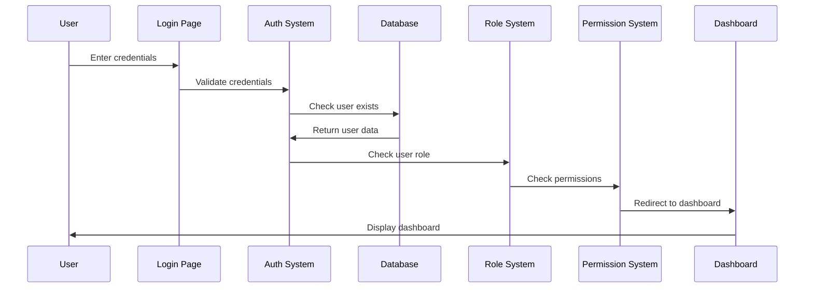
```mermaid
sequenceDiagram
    participant U as User
    participant L as Login Page
    participant A as Auth System
    participant D as Database
    participant R as Role System
    participant P as Permission System
    participant H as Dashboard
    
    U->>L: Enter credentials
    L->>A: Validate credentials
    A->>D: Check user exists
    D->>A: Return user data
    A->>R: Check user role
    R->>P: Check permissions
    P->>H: Redirect to dashboard
    H->>U: Display dashboard
```

### **Role-Based Access Control**
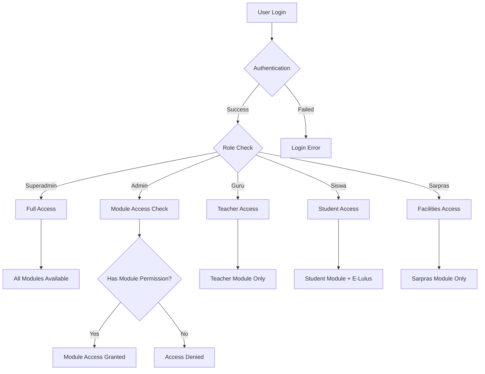
```mermaid
flowchart TD
    A[User Login] --> B{Authentication}
    B -->|Success| C{Role Check}
    B -->|Failed| D[Login Error]
    
    C -->|Superadmin| E[Full Access]
    C -->|Admin| F[Module Access Check]
    C -->|Guru| G[Teacher Access]
    C -->|Siswa| H[Student Access]
    C -->|Sarpras| I[Facilities Access]
    
    E --> J[All Modules Available]
    F --> K{Has Module Permission?}
    K -->|Yes| L[Module Access Granted]
    K -->|No| M[Access Denied]
    
    G --> N[Teacher Module Only]
    H --> O[Student Module + E-Lulus]
    I --> P[Sarpras Module Only]
```

---

## 🛣️ **Route Architecture Flow**

### **Route Structure Overview**
```mermaid
graph TD
    A[Domain Root /] --> B[Landing Page]
    A --> C[Public Features]
    A --> D[Admin Panel /admin]
    
    C --> E[/check-graduation]
    C --> F[/instagram]
    C --> G[/pages]
    C --> H[/page/{slug}]
    
    D --> I[/admin/dashboard]
    D --> J[/admin/superadmin/*]
    D --> K[/admin/guru/*]
    D --> L[/admin/siswa/*]
    D --> M[/admin/osis/*]
    D --> N[/admin/lulus/*]
    D --> O[/admin/sarpras/*]
    D --> P[/admin/instagram/*]
    D --> Q[/admin/pages/*]
    D --> R[/admin/settings/*]
```

### **Public Route Flow**
```mermaid
flowchart TD
    A[User Visits /] --> B[Landing Page]
    B --> C[Custom Menu Navigation]
    C --> D{Menu Type}
    D -->|Internal Page| E[/page/{slug}]
    D -->|External Link| F[External URL]
    D -->|System Feature| G[Feature Page]
    
    E --> H[Page Content Display]
    F --> I[External Website]
    G --> J{Feature Type}
    
    J -->|Graduation Check| K[/check-graduation]
    J -->|Instagram Gallery| L[/instagram]
    J -->|Page Listing| M[/pages]
```

### **Admin Route Security Flow**
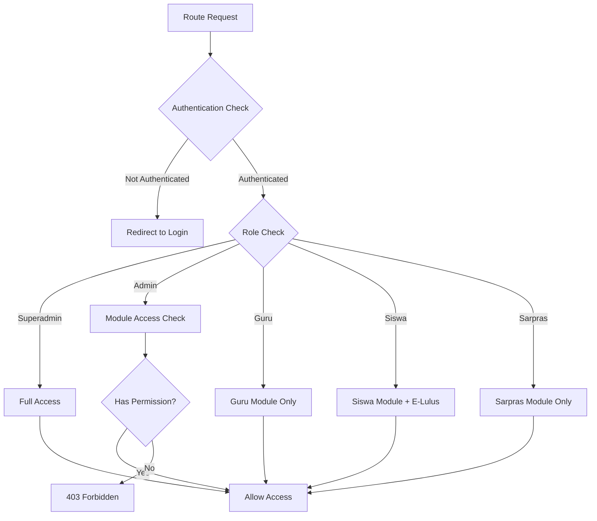
```mermaid
flowchart TD
    A[Route Request] --> B{Authentication Check}
    B -->|Not Authenticated| C[Redirect to Login]
    B -->|Authenticated| D{Role Check}
    
    D -->|Superadmin| E[Full Access]
    D -->|Admin| F[Module Access Check]
    D -->|Guru| G[Guru Module Only]
    D -->|Siswa| H[Siswa Module + E-Lulus]
    D -->|Sarpras| I[Sarpras Module Only]
    
    F --> J{Has Permission?}
    J -->|Yes| K[Allow Access]
    J -->|No| L[403 Forbidden]
    
    E --> K
    G --> K
    H --> K
    I --> K
```

---

## 📱 **Instagram Integration Flow**

### **API Integration Process**
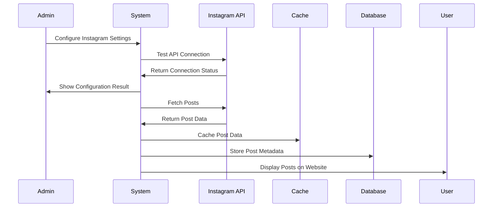
```mermaid
sequenceDiagram
    participant A as Admin
    participant S as System
    participant I as Instagram API
    participant C as Cache
    participant D as Database
    participant U as User
    
    A->>S: Configure Instagram Settings
    S->>I: Test API Connection
    I->>S: Return Connection Status
    S->>A: Show Configuration Result
    
    S->>I: Fetch Posts
    I->>S: Return Post Data
    S->>C: Cache Post Data
    S->>D: Store Post Metadata
    S->>U: Display Posts on Website
```

### **Data Synchronization Flow**
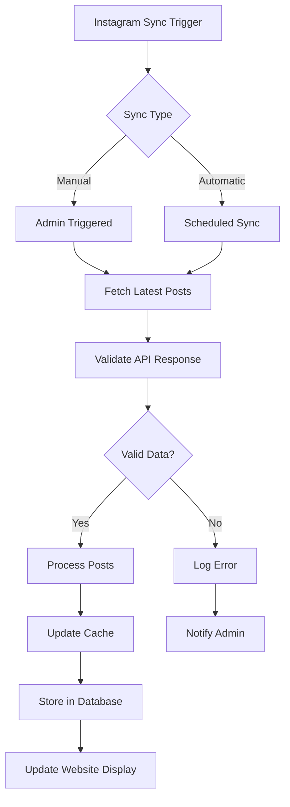
```mermaid
flowchart TD
    A[Instagram Sync Trigger] --> B{Sync Type}
    B -->|Manual| C[Admin Triggered]
    B -->|Automatic| D[Scheduled Sync]
    
    C --> E[Fetch Latest Posts]
    D --> E
    
    E --> F[Validate API Response]
    F --> G{Valid Data?}
    G -->|Yes| H[Process Posts]
    G -->|No| I[Log Error]
    
    H --> J[Update Cache]
    J --> K[Store in Database]
    K --> L[Update Website Display]
    
    I --> M[Notify Admin]
```

---

## 🗳️ **E-OSIS Voting System Flow**

### **Voting Process Flow**
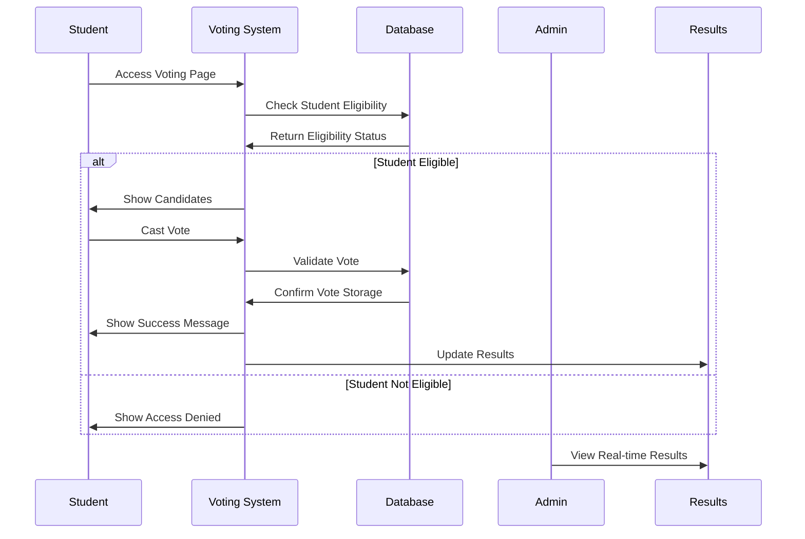
```mermaid
sequenceDiagram
    participant S as Student
    participant V as Voting System
    participant D as Database
    participant A as Admin
    participant R as Results
    
    S->>V: Access Voting Page
    V->>D: Check Student Eligibility
    D->>V: Return Eligibility Status
    
    alt Student Eligible
        V->>S: Show Candidates
        S->>V: Cast Vote
        V->>D: Validate Vote
        D->>V: Confirm Vote Storage
        V->>S: Show Success Message
        V->>R: Update Results
    else Student Not Eligible
        V->>S: Show Access Denied
    end
    
    A->>R: View Real-time Results
```

### **Gender-Based Voting Logic**
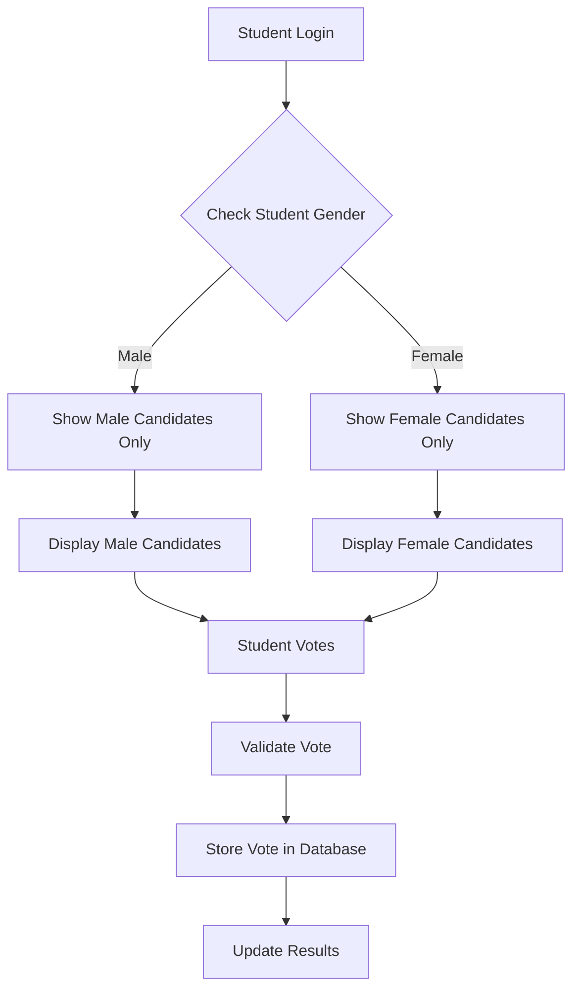
```mermaid
flowchart TD
    A[Student Login] --> B{Check Student Gender}
    B -->|Male| C[Show Male Candidates Only]
    B -->|Female| D[Show Female Candidates Only]
    
    C --> E[Display Male Candidates]
    D --> F[Display Female Candidates]
    
    E --> G[Student Votes]
    F --> G
    
    G --> H[Validate Vote]
    H --> I[Store Vote in Database]
    I --> J[Update Results]
```

### **Teacher Voting Logic**
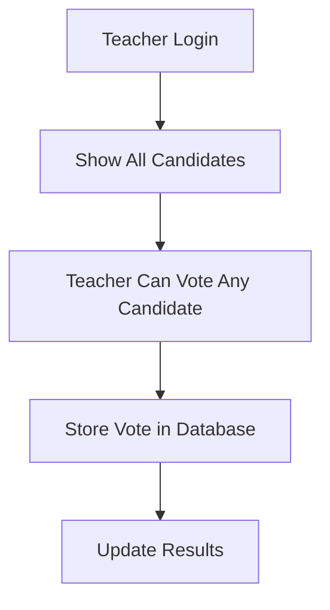
```mermaid
flowchart TD
    A[Teacher Login] --> B[Show All Candidates]
    B --> C[Teacher Can Vote Any Candidate]
    C --> D[Store Vote in Database]
    D --> E[Update Results]
```

---

## 🎓 **E-Lulus Graduation System Flow**

### **Graduation Data Import Flow**
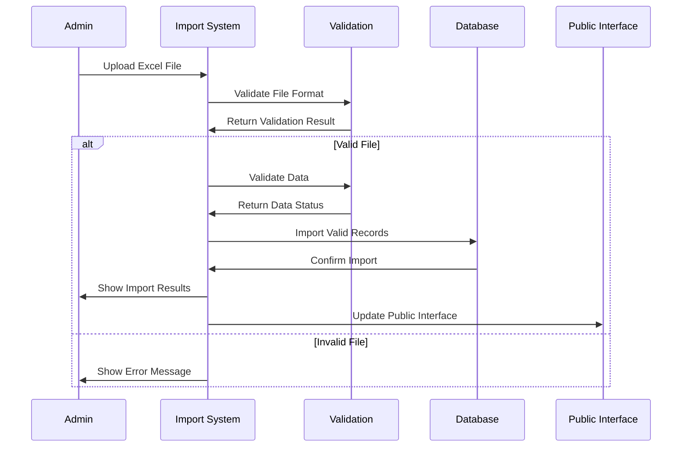
```mermaid
sequenceDiagram
    participant A as Admin
    participant I as Import System
    participant V as Validation
    participant D as Database
    participant P as Public Interface
    
    A->>I: Upload Excel File
    I->>V: Validate File Format
    V->>I: Return Validation Result
    
    alt Valid File
        I->>V: Validate Data
        V->>I: Return Data Status
        I->>D: Import Valid Records
        D->>I: Confirm Import
        I->>A: Show Import Results
        I->>P: Update Public Interface
    else Invalid File
        I->>A: Show Error Message
    end
```

### **Public Graduation Check Flow**
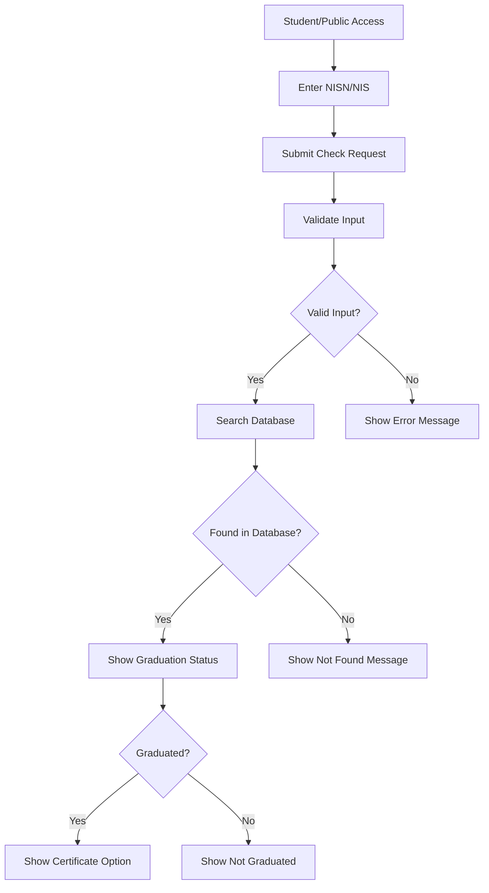
```mermaid
flowchart TD
    A[Student/Public Access] --> B[Enter NISN/NIS]
    B --> C[Submit Check Request]
    C --> D[Validate Input]
    D --> E{Valid Input?}
    
    E -->|Yes| F[Search Database]
    E -->|No| G[Show Error Message]
    
    F --> H{Found in Database?}
    H -->|Yes| I[Show Graduation Status]
    H -->|No| J[Show Not Found Message]
    
    I --> K{Graduated?}
    K -->|Yes| L[Show Certificate Option]
    K -->|No| M[Show Not Graduated]
```

---

## 🏢 **Sarpras Management Flow**

### **Asset Management Process**
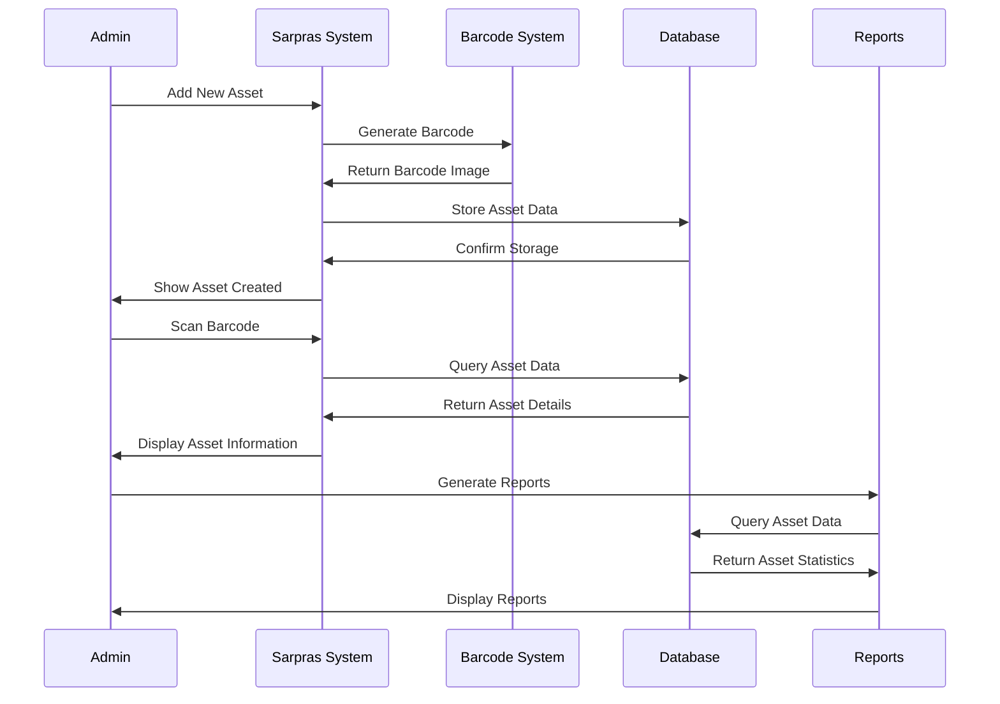
```mermaid
sequenceDiagram
    participant A as Admin
    participant S as Sarpras System
    participant B as Barcode System
    participant D as Database
    participant R as Reports
    
    A->>S: Add New Asset
    S->>B: Generate Barcode
    B->>S: Return Barcode Image
    S->>D: Store Asset Data
    D->>S: Confirm Storage
    S->>A: Show Asset Created
    
    A->>S: Scan Barcode
    S->>D: Query Asset Data
    D->>S: Return Asset Details
    S->>A: Display Asset Information
    
    A->>R: Generate Reports
    R->>D: Query Asset Data
    D->>R: Return Asset Statistics
    R->>A: Display Reports
```

### **Maintenance Tracking Flow**
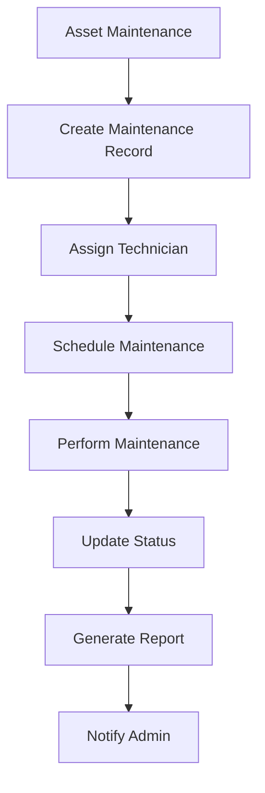
```mermaid
flowchart TD
    A[Asset Maintenance] --> B[Create Maintenance Record]
    B --> C[Assign Technician]
    C --> D[Schedule Maintenance]
    D --> E[Perform Maintenance]
    E --> F[Update Status]
    F --> G[Generate Report]
    G --> H[Notify Admin]
```

---

## 📄 **Page Management System Flow**

### **Content Creation Flow**
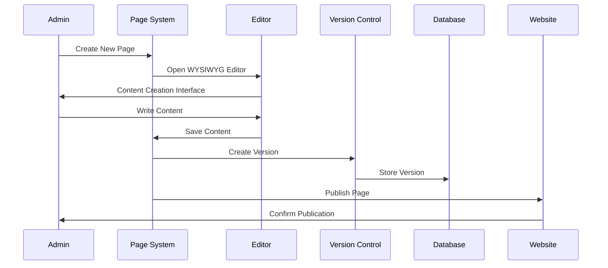
```mermaid
sequenceDiagram
    participant A as Admin
    participant P as Page System
    participant E as Editor
    participant V as Version Control
    participant D as Database
    participant W as Website
    
    A->>P: Create New Page
    P->>E: Open WYSIWYG Editor
    E->>A: Content Creation Interface
    A->>E: Write Content
    E->>P: Save Content
    P->>V: Create Version
    V->>D: Store Version
    P->>W: Publish Page
    W->>A: Confirm Publication
```

### **Version Control Flow**
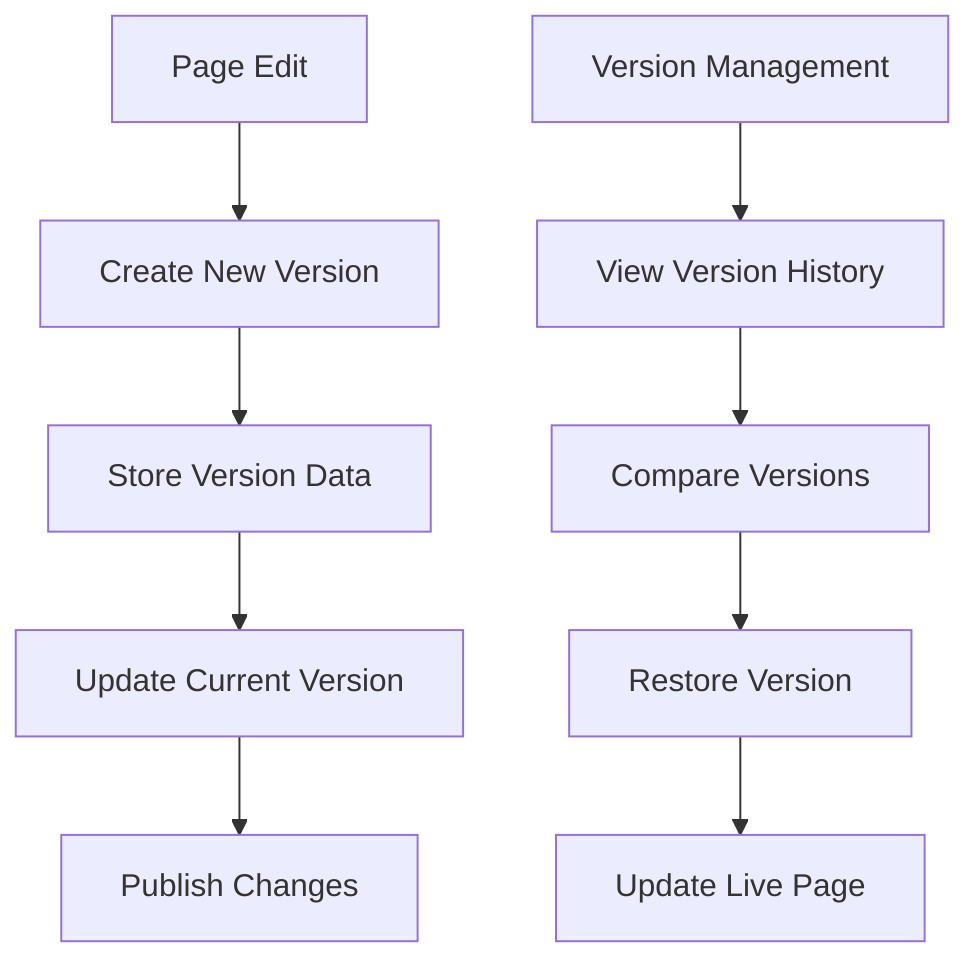
```mermaid
flowchart TD
    A[Page Edit] --> B[Create New Version]
    B --> C[Store Version Data]
    C --> D[Update Current Version]
    D --> E[Publish Changes]
    
    F[Version Management] --> G[View Version History]
    G --> H[Compare Versions]
    H --> I[Restore Version]
    I --> J[Update Live Page]
```

---

## 📊 **Import/Export System Flow**

### **Excel Import Process**
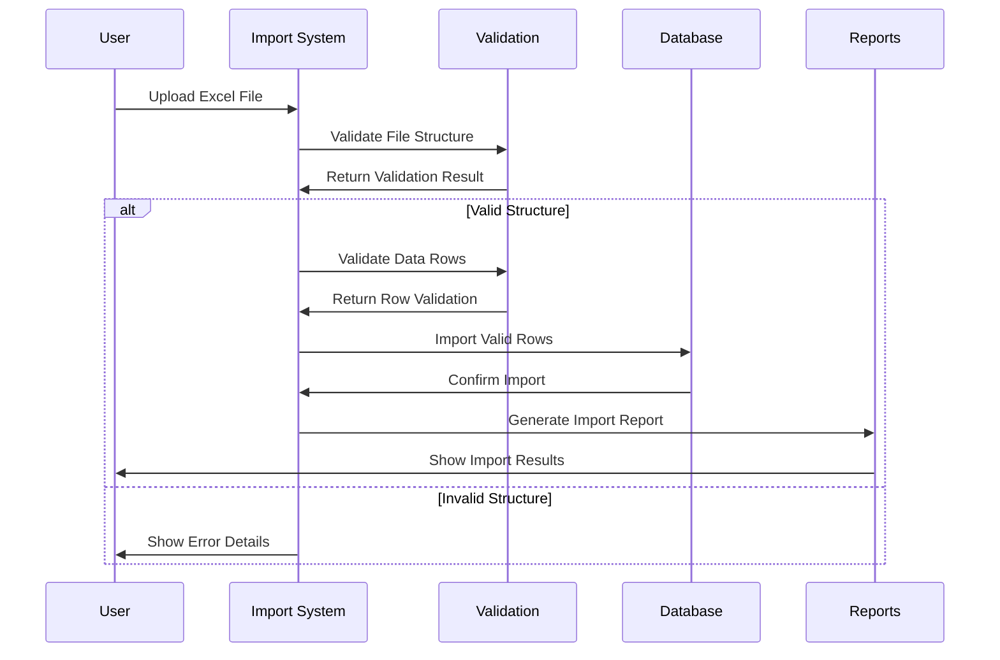
```mermaid
sequenceDiagram
    participant U as User
    participant I as Import System
    participant V as Validation
    participant D as Database
    participant R as Reports
    
    U->>I: Upload Excel File
    I->>V: Validate File Structure
    V->>I: Return Validation Result
    
    alt Valid Structure
        I->>V: Validate Data Rows
        V->>I: Return Row Validation
        I->>D: Import Valid Rows
        D->>I: Confirm Import
        I->>R: Generate Import Report
        R->>U: Show Import Results
    else Invalid Structure
        I->>U: Show Error Details
    end
```

### **Excel Export Process**
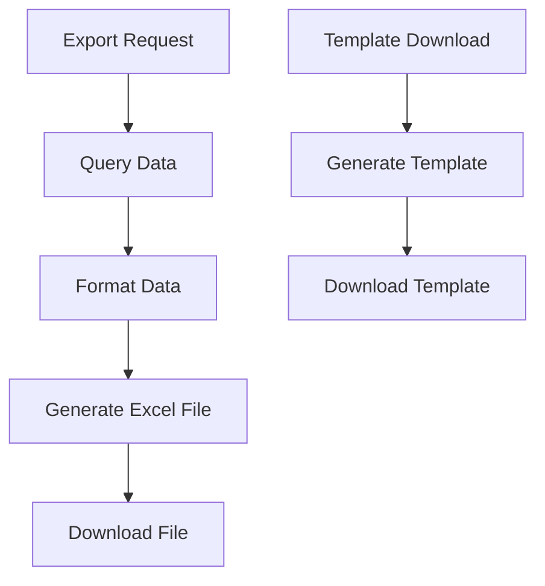
```mermaid
flowchart TD
    A[Export Request] --> B[Query Data]
    B --> C[Format Data]
    C --> D[Generate Excel File]
    D --> E[Download File]
    
    F[Template Download] --> G[Generate Template]
    G --> H[Download Template]
```

---

## 🎨 **Frontend User Experience Flow**

### **Responsive Design Flow**
```mermaid
flowchart TD
    A[User Access] --> B{Device Detection}
    B -->|Mobile| C[Mobile Layout]
    B -->|Tablet| D[Tablet Layout]
    B -->|Desktop| E[Desktop Layout]
    
    C --> F[Mobile Navigation]
    D --> G[Tablet Navigation]
    E --> H[Desktop Navigation]
    
    F --> I[Mobile-Optimized Content]
    G --> J[Tablet-Optimized Content]
    H --> K[Desktop-Optimized Content]
```

### **Interactive Component Flow**
```mermaid
sequenceDiagram
    participant U as User
    participant I as Interface
    participant J as JavaScript
    participant A as AJAX
    participant S as Server
    participant D as Database
    
    U->>I: User Interaction
    I->>J: Trigger Event
    J->>A: Send Request
    A->>S: Process Request
    S->>D: Query Data
    D->>S: Return Data
    S->>A: Send Response
    A->>J: Update Interface
    J->>I: Refresh Display
    I->>U: Show Updated Content
```

---

## 🔒 **Security Implementation Flow**

### **Data Validation Flow**
```mermaid
flowchart TD
    A[User Input] --> B[Client-Side Validation]
    B --> C{Valid?}
    C -->|No| D[Show Error Message]
    C -->|Yes| E[Send to Server]
    
    E --> F[Server-Side Validation]
    F --> G{Valid?}
    G -->|No| H[Return Validation Error]
    G -->|Yes| I[Sanitize Input]
    I --> J[Process Request]
    J --> K[Store in Database]
```

### **Authentication Security Flow**
```mermaid
sequenceDiagram
    participant U as User
    participant L as Login System
    participant A as Auth System
    participant S as Session
    participant D as Database
    
    U->>L: Login Attempt
    L->>A: Validate Credentials
    A->>D: Check User Data
    D->>A: Return User Info
    
    alt Valid Credentials
        A->>S: Create Session
        S->>A: Confirm Session
        A->>U: Login Success
    else Invalid Credentials
        A->>L: Login Failed
        L->>U: Show Error Message
    end
```

---

## 📈 **Performance Optimization Flow**

### **Caching Strategy Flow**
```mermaid
flowchart TD
    A[User Request] --> B{Cache Check}
    B -->|Cache Hit| C[Return Cached Data]
    B -->|Cache Miss| D[Database Query]
    D --> E[Process Data]
    E --> F[Store in Cache]
    F --> G[Return Data]
    C --> H[Response to User]
    G --> H
```

### **Database Query Optimization Flow**
```mermaid
sequenceDiagram
    participant C as Controller
    participant M as Model
    participant Q as Query Builder
    participant D as Database
    participant R as Result
    
    C->>M: Request Data
    M->>Q: Build Optimized Query
    Q->>D: Execute Query
    D->>Q: Return Data
    Q->>M: Process Result
    M->>C: Return Model Data
    C->>R: Format Response
```

---

## 🚀 **Deployment Flow**

### **Production Deployment Process**
```mermaid
flowchart TD
    A[Development Complete] --> B[Code Review]
    B --> C[Testing Phase]
    C --> D{All Tests Pass?}
    D -->|No| E[Fix Issues]
    E --> C
    D -->|Yes| F[Build Production Assets]
    F --> G[Database Migration]
    G --> H[Environment Configuration]
    H --> I[Deploy to Server]
    I --> J[Verify Deployment]
    J --> K[Production Ready]
```

### **Environment Configuration Flow**
```mermaid
sequenceDiagram
    participant D as Developer
    participant E as Environment
    participant C as Configuration
    participant S as Server
    participant A as Application
    
    D->>E: Setup Environment
    E->>C: Load Configuration
    C->>S: Configure Server
    S->>A: Initialize Application
    A->>E: Confirm Setup
    E->>D: Environment Ready
```

---

## 📊 **Analytics & Reporting Flow**

### **Dashboard Analytics Flow**
```mermaid
flowchart TD
    A[Dashboard Load] --> B[Fetch Statistics]
    B --> C[User Statistics]
    B --> D[Module Statistics]
    B --> E[Performance Statistics]
    
    C --> F[Display User Metrics]
    D --> G[Display Module Metrics]
    E --> H[Display Performance Metrics]
    
    F --> I[Update Dashboard]
    G --> I
    H --> I
```

### **Report Generation Flow**
```mermaid
sequenceDiagram
    participant U as User
    participant R as Report System
    participant Q as Query Engine
    participant D as Database
    participant F as File Generator
    participant U as User
    
    U->>R: Request Report
    R->>Q: Build Query
    Q->>D: Execute Query
    D->>Q: Return Data
    Q->>F: Generate Report
    F->>R: Return Report
    R->>U: Deliver Report
```

---

## 🎯 **System Integration Flow**

### **Module Integration Architecture**
```mermaid
graph TB
    A[Core System] --> B[Authentication Module]
    A --> C[User Management Module]
    A --> D[Permission Module]
    
    E[Academic Modules] --> F[Student Management]
    E --> G[Teacher Management]
    E --> H[Subject Management]
    
    I[System Modules] --> J[Page Management]
    I --> K[Instagram Integration]
    I --> L[Settings Management]
    
    M[Special Modules] --> N[E-OSIS Voting]
    M --> O[E-Lulus Graduation]
    M --> P[Sarpras Management]
    
    A --> E
    A --> I
    A --> M
```

---

## 📋 **System Requirements Flow**

### **Technical Requirements**
```mermaid
flowchart TD
    A[System Requirements] --> B[Server Requirements]
    A --> C[Database Requirements]
    A --> D[Web Server Requirements]
    A --> E[PHP Requirements]
    
    B --> F[Minimum 1GB RAM]
    B --> G[Minimum 10GB Storage]
    
    C --> H[MySQL 5.7+ or PostgreSQL 12+]
    
    D --> I[Apache/Nginx with mod_rewrite]
    
    E --> J[PHP 8.1+ with extensions]
```

---

## 🏆 **Quality Assurance Flow**

### **Testing Process Flow**
```mermaid
flowchart TD
    A[Feature Development] --> B[Unit Testing]
    B --> C[Integration Testing]
    C --> D[System Testing]
    D --> E[User Acceptance Testing]
    E --> F{All Tests Pass?}
    F -->|No| G[Fix Issues]
    G --> B
    F -->|Yes| H[Deploy to Production]
```

---

## 📚 **Documentation & Support Flow**

### **User Support Process**
```mermaid
flowchart TD
    A[User Request] --> B[Support Ticket]
    B --> C[Ticket Classification]
    C --> D{Support Level}
    D -->|Basic| E[Documentation Reference]
    D -->|Advanced| F[Technical Support]
    D -->|Critical| G[Priority Support]
    
    E --> H[User Self-Service]
    F --> I[Technical Assistance]
    G --> J[Immediate Response]
```

---

**Last Updated:** December 2024  
**Status:** ✅ **COMPLETE SYSTEM FLOW DOCUMENTATION**  
**Version:** 2.0 Professional Edition

---

*This documentation provides comprehensive flow diagrams for all system processes, ensuring clear understanding of the School Management System architecture and operations.*